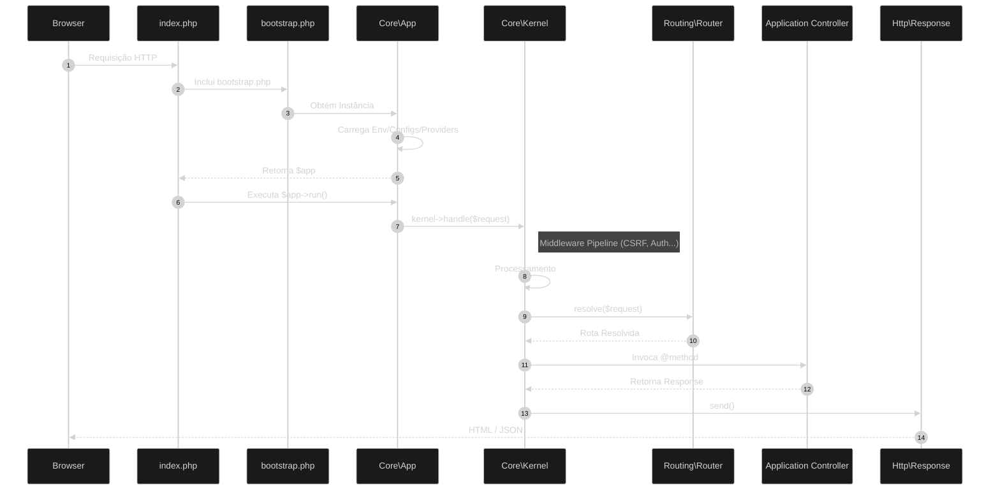

# Ciclo de Vida da Requisição

O ZyoPHP segue um fluxo linear e orientado a camadas para processar cada requisição HTTP.

## Diagrama de Fluxo

## Etapas Detalhadas

### 1. Ponto de Entrada (`public/index.php`)
O Servidor Web (Apache/Nginx) direciona todas as requisições para este arquivo. Ele:
- Define constantes globais (`BASE_PATH`).
- Carrega o Autoloader do Composer.
- Solicita a inicialização ao `src/bootstrap.php`.

### 2. Bootstrap (`src/bootstrap.php`)
Responsável por "acender" o framework:
- Obtém a instância singleton do `Zyo\Core\App`.
- Configura o `BASE_PATH` no container.
- Retorna o objeto `$app` para o Front Controller.

### 3. Registro e Boot (`Zyo\Core\App`)

Diferente de frameworks pesados, o ZyoPHP utiliza um processo de bootstrapping otimizado:
- **BasePaths**: Ao ser instanciada, a `App` define os caminhos fundamentais (`path`, `path.config`, etc).
- **ServiceProviders**: Os provedores de serviço são registrados para ligar as interfaces às suas implementações no container.
- **Kernel Handle**: O `$app->run()` invoca o `Kernel`, que assume a responsabilidade de processar o ciclo de vida.

### 4. Kernel (`Zyo\Core\Kernel`)
O Kernel gerencia a "viagem" da requisição, orquestrando:
- **Middleware Pipeline**: A requisição atravessa a cebola de middlewares (global/route).
- **Routing**: O `Router` encontra a rota correspondente.

### 5. Resolução de Controle
O framework utiliza o **Container de DI** para instanciar o Controller e injetar suas dependências automaticamente no construtor.

### 6. Resposta (`Zyo\Http\Response`)
Toda rota ou controller deve retornar um objeto `Response` (ou uma `View` que é convertida em Response). O Kernel chama `send()` para enviar o conteúdo final ao Browser.
