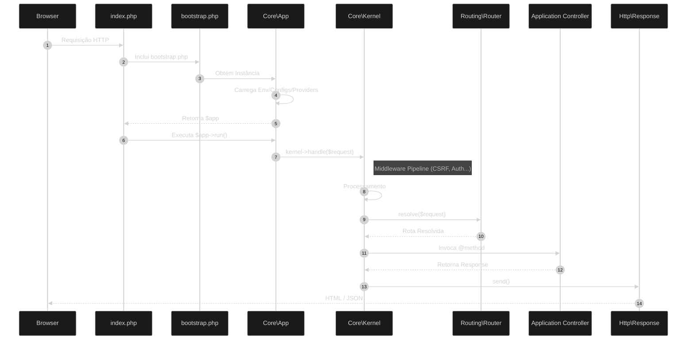

# Ciclo de Vida da Requisição

O ZyoPHP segue um fluxo linear e orientado a camadas para processar cada requisição HTTP.

## Diagrama de Fluxo

## Etapas Detalhadas

### 1. Ponto de Entrada (`public/index.php`)
O Servidor Web (Apache/Nginx) direciona todas as requisições para este arquivo. Ele:
- Define constantes globais (`BASE_PATH`).
- Carrega o Autoloader do Composer.
- Solicita a inicialização ao `src/bootstrap.php`.

### 2. Bootstrap (`src/bootstrap.php`)
Responsável por "acender" o framework:
- Obtém a instância singleton do `Zyo\Core\App`.
- Configura o `BASE_PATH` no container.
- Retorna o objeto `$app` para o Front Controller.

### 3. Registro e Boot (`Zyo\Core\App`)
Ao iniciar, o objeto `App`:
- **Load Env**: Carrega o arquivo `.env`.
- **Load Config**: Carrega as configurações de `app/Config/`.
- **Register Providers**: Registra todos os Service Providers do sistema.
- **Boot Providers**: Invoca o método `boot()` de cada provider.

### 4. Kernel (`Zyo\Core\Kernel`)
O Kernel gerencia a "viagem" da requisição:
- **Middleware**: A requisição atravessa a cebola (*onion*) de middlewares globais e de rota.
- **Routing**: O `Router` encontra a rota correspondente e extrai parâmetros.

### 5. Resolução de Controle
O framework utiliza o **Container de DI** para instanciar o Controller e injetar suas dependências automaticamente no construtor.

### 6. Resposta (`Zyo\Http\Response`)
Toda rota ou controller deve retornar um objeto `Response` (ou uma `View` que é convertida em Response). O Kernel chama `send()` para enviar o conteúdo final ao Browser.
